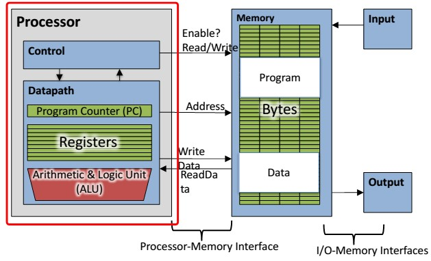

**Information Technology University RISC-V IG (Verilog Week)**

**RISC Based Processor Design**

​										 **Figure 1: Datapath of a RISC-V Based Processor**

The design is discussed in more details as follows:

# Memory

-   256 memory locations with 8bit address
-   Each memory location contains one 16-bit word **Registers**
-   Eight 16-bit integer registers (R0, R1, R2, R3, R4, R5, R6, R7)
-   16-bit program counter (PC)
-   Flags Register (N, Z, C)

# Instruction Opcodes

Double-Source Operands dest_reg = src1_reg **operation** src2_reg 

Single-Source Operands dest_reg = **operation** src2_reg 

Basic format for 16-bit instructions is as follows:

| Opcode     | Des_reg | Src1_reg | Src2_reg** |
| ---------- | ------- | -------- | ---------- |
| Bits 15:12 | 11:8    | 7:4      | 3:0        |

In case of memory read or write our 16-bit instruction becomes:

| **Opcode**  | **Register**  | **Memory**  |
|-------------|---------------|-------------|
| Bits 15:12  | 11:8          | 7:0         |

# Operations 

These are the Operations of ALU must do.

| Instruction | Meaning/Explaination                                         |
| ----------- | ------------------------------------------------------------ |
| sub         | subtracts source register values and saves to destination register. |
| **and**     | compares reg1 with reg2 and saves 1 if reg1\>reg2 else saves zero in the estination. |
| **cat**     | concatenates the most significant 4bits of reg1 and reg2.    |
| **load**    | instructions move data from memory at 8-bit address to registers. |
| **store**   | instructions move data from registers to memory at 8-bit address. |
| **remv**    | stores zero to memory at 8-bit address.                      |
| **ceil**    | stores FFFF to memory at 8-bit address.                      |
| **mov**     | stores reg1 to destination register.                         |
| **clr**     | sets destination register to zero.                           |
| **inc**     | increments destination register.                             |
| **dec**     | decrements destination register.                             |
| **shl**     | **left** shifts the contents of the destination register by the number at reg2. |
| **shr**     | **right** shifts the contents of the destination register by the number at reg2. |
| **rol**     | **left** rotates the contents of the destination register by the number at reg2. |
| **ror**     | **right** rotates the contents of the destination register by the number at reg2. |

Note: 16-bit instruction opcodes are provided by your Verilog Testbench which will behave as program counter.

**To Do:**

1.  Write all the required modules for your processor demonstrated above.
2.  Write a module for memory in which declaration and initialization of memory is being done.
3.  Write a testbench module which provides 16-bit instruction opcodes and clock to the processor.

**Deliverables:**

1.  Verilog Codes.
2.  Screenshot of Schematics
3.  Screenshot of Resource Utilization
4.  Screenshot of Power
5.  Testbench code
6.  Screenshot of Simulation
